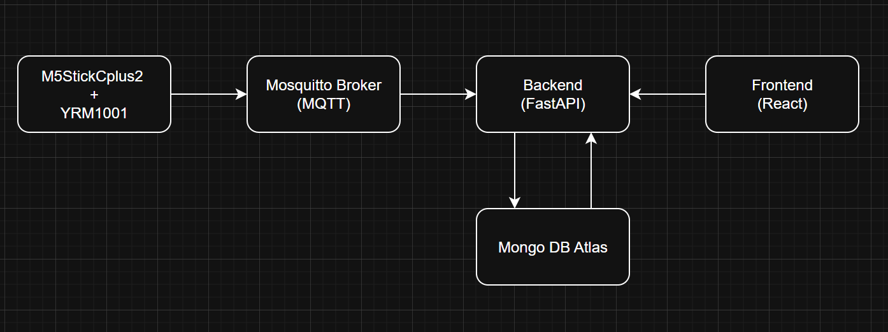

## Componentes

### 1. Capa IoT (Dispositivos)
- **M5StickCPlus2:** Microcontrolador ESP32-S3
- **YRM1001:** Lector RFID UHF
- **Protocolo:** MQTT sobre WiFi

### 2. Capa de Comunicación
- **Broker MQTT:** Mosquitto
- **Protocolo:** MQTT 3.1.1
- **Topic:** `rfid/tags`

### 3. Capa Backend
- **Framework:** FastAPI (Python)
- **Base de datos:** MongoDB Atlas
- **Comunicación:** REST API + WebSocket

### 4. Capa Frontend
- **Framework:** Angular
- **Visualización:** Chart.js
- **Comunicación:** HTTP REST

## Flujo de Datos

1. **Captura:** Dispositivo lee tag RFID
2. **Transmisión:** Datos enviados via MQTT
3. **Procesamiento:** Backend recibe y valida
4. **Almacenamiento:** Guardado en MongoDB
5. **Visualización:** Frontend muestra en tiempo real
